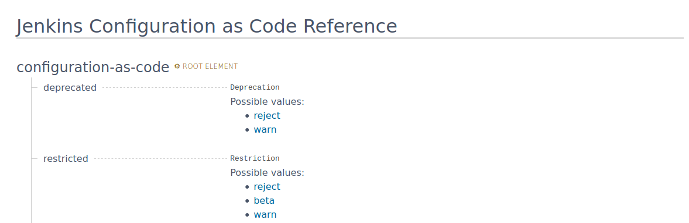
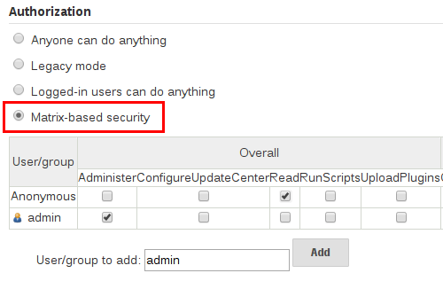

# Configuring plugins

In this exercise, we are going to configure some of the plugins we have setup through JCasC.
In that way, the configuration is the same even when recreating your instances.

Since Jenkins has thousands of plugins, we are only going to cover a small selection of them, but the process is the same for them all.

In the first task, we are going to setup the plugin `matrix-auth` which will allow you to make fine grained authorization schemas.

Following that, we will add an SSH key to the configuration, enabling Jenkins to connect to a server through the SSH protocol.

## Overall configuration

To help you out, the JCasC community have made two things for you to take advantage of, examples and documentation.

The examples are listed in the JCasC repository under [/master/demos](https://github.com/jenkinsci/configuration-as-code-plugin/tree/master/demos).
They provide a great starting point to see how

If the community have not made an example yet, or the example does not display what you need, you can go in and look at the documentation under the JCasC page.



JCasC structure in the documentation mimics the same structure as the YAML structure, guiding you on how your YAML file should look like.

### Task

- Find the documentation page by navigating `Manage Jenkins` -> `Configuration as Code` -> `Documentation`
- Look at your `jenkins.yaml` configuration and the documentation page
- Find out where the system message should be, and make it have the following message: `Jenkins is now configured with JCasC`
- Reload the configuration and see the change applied to the front page of Jenkins.

## Matrix based security

Matrix based authorization scheme allows for granular control over which users and groups are able to perform which actions in the Jenkins environment (see the screenshot below).



In that way you can let specific users or groups have fine grained access to e.g. looking at jobs, run them, or configure them.

### Task

**Manage Jenkins** -> **Configure Global Security**

- Enable security
- Authorization -> Matrix-based security

Look at it, but do not save. "Leave page"

- Find "matrix-auth" under

  [the demos in JCasC repository](https://github.com/jenkinsci/configuration-as-code-plugin/tree/master/demos)

- It's a good starting example, try to implement and reload Jenkins
- Add `- "Job/Read:anonymous"`
- Logout
- Watch
- Log in and make a single branch pipeline job with hello world
- Log out to see that you can still see it.

## Credentials

credentials is another root element, just like jenkins in YAML.
[JCasC demos](https://github.com/jenkinsci/configuration-as-code-plugin/tree/master/demos/credentials)

We are adding SSH Credentials by adding a docker-compose secret.

Scope needs to be GLOBAL

!!! Any manually added credentials gets deleted when you reload jenkins

```
credentials:
  system:
    domainCredentials:

      - credentials:
          - basicSSHUserPrivateKey:

              scope: GLOBAL
              id: host_secret
              username: ubuntu
              description: "SSH passphrase with private key file. Private key provided"
              privateKeySource:
                directEntry:
                  privateKey: ${abc}

```

### Tasks

add secret to the docker-compose file
down and up the docker-compose
add the jenkins configuration snippet

!!! find a way to update known-hosts

!!! make a pipeline that ssh into the instance provided with the SSH
credentials that we are having. test it out

```groovy
pipeline {
   agent any

   stages {
    stage ('Deploy') {
    steps{
        sshagent(credentials : ['host_secret']) {
            sh 'ssh -oStrictHostKeyChecking=no ubuntu@104.155.51.100'
        }
    }
}
   }
}
```

## Further readings

[JCasC demos](https://github.com/jenkinsci/configuration-as-code-plugin/tree/master/demos)
